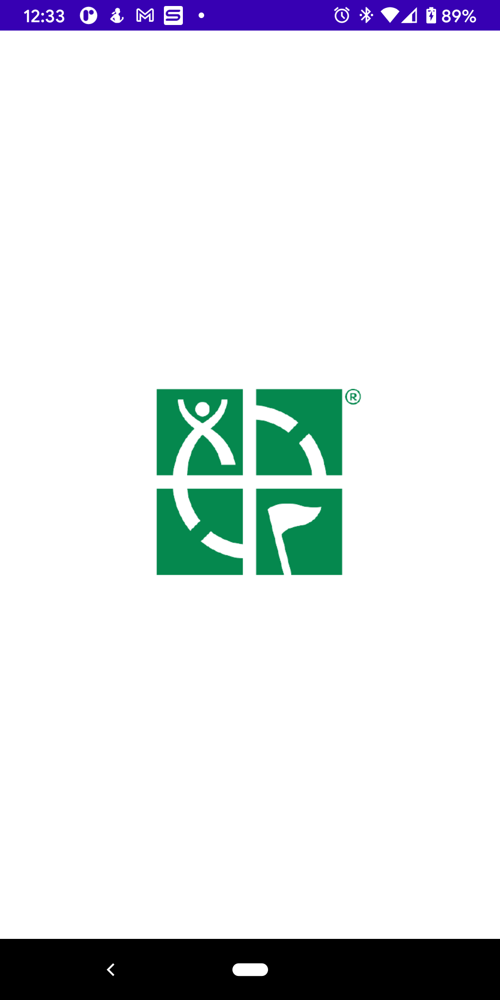
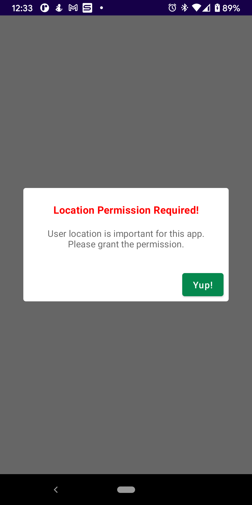
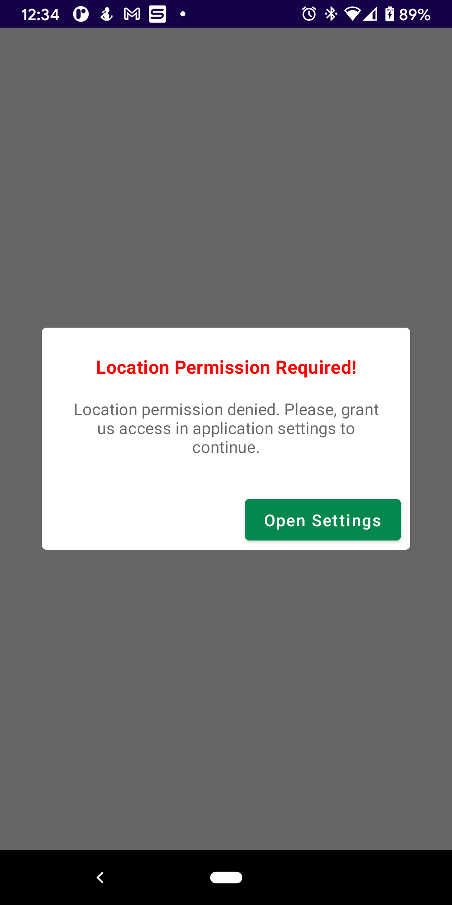
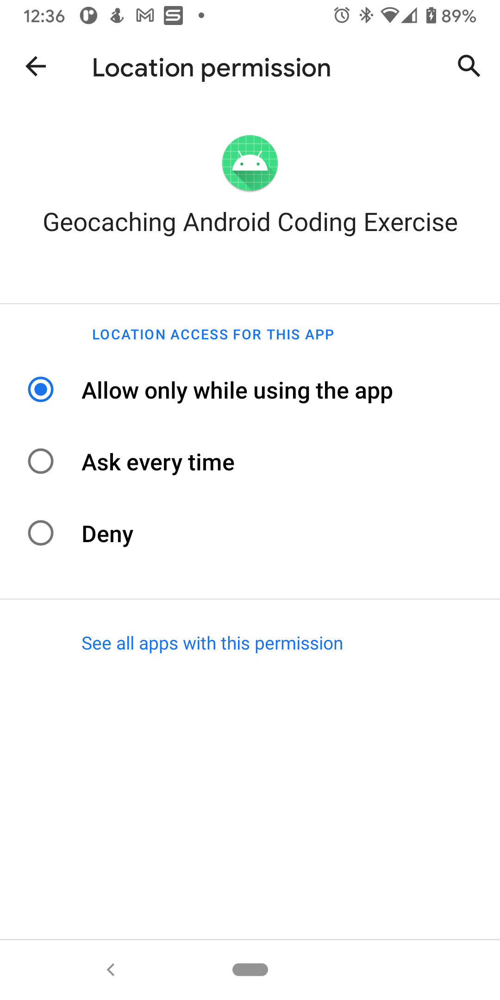
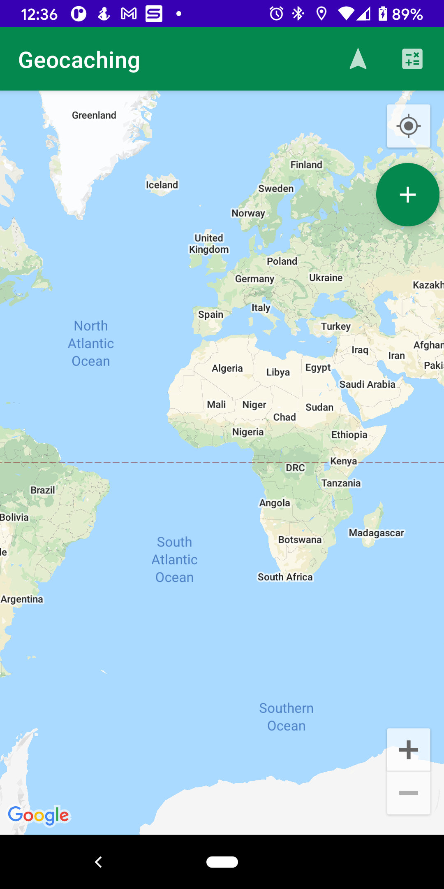

# Geocaching-Android-Coding-Exercise

**Author**: Marchael Acode

**Version**: 1.0.0

## Overview

- Android application that uses Google Maps technology to locate user's current location, drop a marker on user's current location, navigate to pinned location, center map view to user's current location and calculate the distance from user location to pinned location.

## Google Maps API Key Implementation

1. Create "gradle.properties" file
    - Select to "My PC"
    - Select drive that store "Users" folder
    - Select your user folder
    - Select ".gradle" folder
    - Within this folder create new text document
2. Within text document, create key name and value. My example: GOOGLE_MAPS_API_KEY_GEOCACHING="<YOUR API KEY>"
3. Save file as "gradle.properties" and make sure to put quotes around gradle.properties
4. Within your app build.gradle file there is a buildTypes block which looks like example below.
    - `buildTypes {
            debug {
                buildConfigField 'String', "GeocachingApiKey", GOOGLE_MAPS_API_KEY_GEOCACHING
                resValue 'string', "GeocachingApiKey", GOOGLE_MAPS_API_KEY_GEOCACHING
            }
            release {
                minifyEnabled false
                proguardFiles getDefaultProguardFile('proguard-android-optimize.txt'), 'proguard-rules.pro'
                buildConfigField 'String', "GeocachingApiKey", GOOGLE_MAPS_API_KEY_GEOCACHING
                resValue 'String', "GeocachingApiKey", GOOGLE_MAPS_API_KEY_GEOCACHING
            }
        }`
    - If you are using a different key name in step 2, then you must replace your key name with GOOGLE_MAPS_API_KEY_GEOCACHING in the above example.
    - "GeocachingApiKey" is the key name I chose, but you can name this anything.
5. Sync your app build.gradle file.
6. I recommend rebuilding your project.
    - To do this within Android Studio, click top tab named "Build"
    - Click on "Rebuild Project"
7. Check for the generated files called "gradleResValues.xml" that has your API key
    - In Android Studios, hit the Android dropdown in the top left corner.
    - Select "Project", then "app", then "build", then "generated", then "res", then "resValues", then "debug", then "values".
8. Add string to Android Manifest and you can access the string within other files using "BuildConfig.<Your string key name>"
9. If this was confusing instructions to follow, there is a step-by-step youtube video that explains it all.
    - [Protect API key when pushing to Github](https://www.youtube.com/watch?v=Dhm9LPybnHE&t=240s)
10. If all else fails, just hardcode your Google Maps API key into the code. Hope this helps!

## User Stories

- User Story:
    - As a user, I would like to be able to access a global map view.
    - Feature Tasks:
        - Enable Maps SDK for Android in Google Cloud Console.
        - Create Google Maps API Key.
        - Create map view lifecycle and observer composable.
        - Create map view composable and create instance of GoogleMap from mapView.

- User Story:
    - As a user, I would like to be asked permission to use my device's location.
    - Feature Tasks:
        - Add internet, fine and coarse permissions to manifest file.
        - Check if user permission is granted.
        - If user denies location permission, prompt user to change in application settings.
        - If location permission is granted, navigate user to map view screen.

- User Story:
    - As a user, I would like to know my current location within the map view.
    - Feature Tasks:
        - Create function that checks user's location permission is granted.
        - Create function that gets device's location.
        - Create function that retrieves updates of user's current location.

- User Story:
    - As a user, I would like to be able to drop a pin on the map to remember where I parked my car.
    - Feature Tasks:
        - Created action button that places a marker on user's current location.
        - Retrieve and save the coordinates of user's current location.
        - Transfer user's current location to marker coordinates to place pin on the map.
        - If button is pressed again, remove old marker with a new marker of user's current location.

- User Story:
    - As a user, I would like be shown navigational directions back to the pinned location where I left my car
    - Feature Tasks:
        - Create menu item button that navigates user to pinned location.
        - Retrieve coordinates of pinned location and user's current location.
        - Enable Google Maps Direction API within Google Cloud Console.
        - Create function that makes a request to Direction API for routes.
        - Mark route with poly lines to pinned location on map view.
        - If navigation button is pressed again, remove poly lined route.

- User Story:
    - As a user, I would like to center the map back at my current location.
    - Feature Tasks:
        - Short way: Set ".isMyLocationEnable" of map view instance to true.
        - Long way: Create a menu item button that retrieves user's current location and zooms map on coordinates.

- User Story:
    - As a user, I would like to know the distance from my current location to the pinned location on the map view.
    - Feature Tasks:
        - Created menu item button that gives the total distance from pinned location.
        - Enable Google Maps Direction API within Google Cloud Console.
        - Create function that makes a request to Direction API for routes.
        - Retrieve Direction API response data and extract the distance
        - Create alert dialog that informs the total distance to the user.
    
## Wireframes / ScreenShots

-  

- 

- 

- 

- 

## Credit and Collaboration

- [Accompanist Permissions](https://google.github.io/accompanist/permissions/)

- [Direction API Request](https://github.com/lawgimenez/googlemapsdirectionssample/blob/main/app/src/main/java/com/livinideas/googlemapsdirectionsample/MainActivity.kt)

- [Shorter Direction API Request](https://stackoverflow.com/questions/60246852/can-you-get-the-response-data-from-volley-outside-of-the-stringrequest-variable)

- [Remember Map View Lifecycle and Observer](https://github.com/kahdichienja/jetMap/blob/main/app/src/main/java/com/kchienja/jetmap/MainActivity.kt)

- [Protect API key when pushing to Github](https://www.youtube.com/watch?v=Dhm9LPybnHE&t=240s)